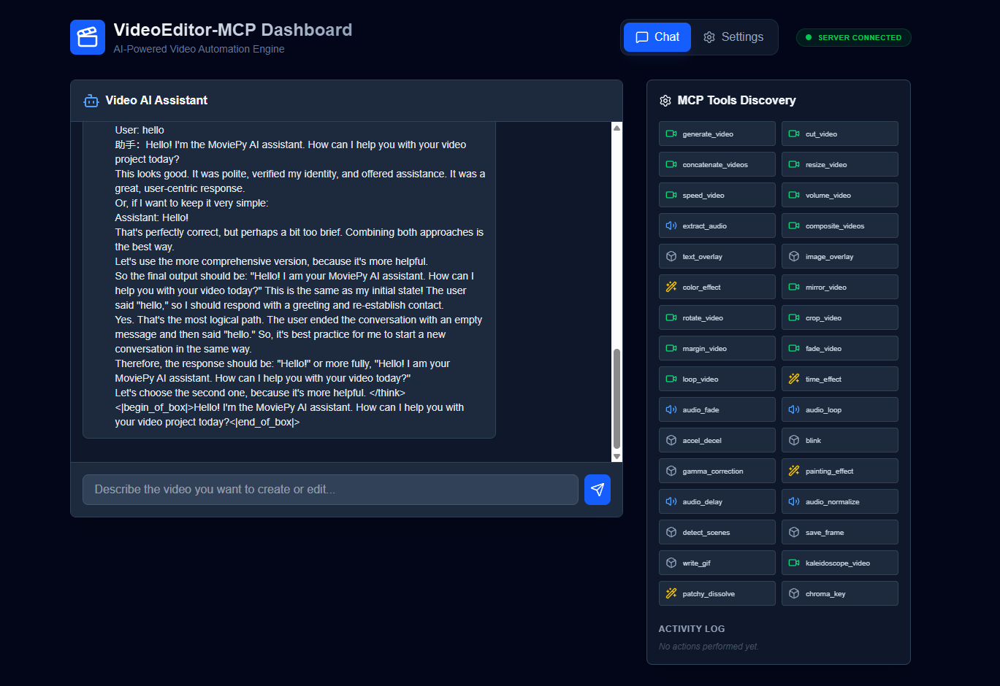
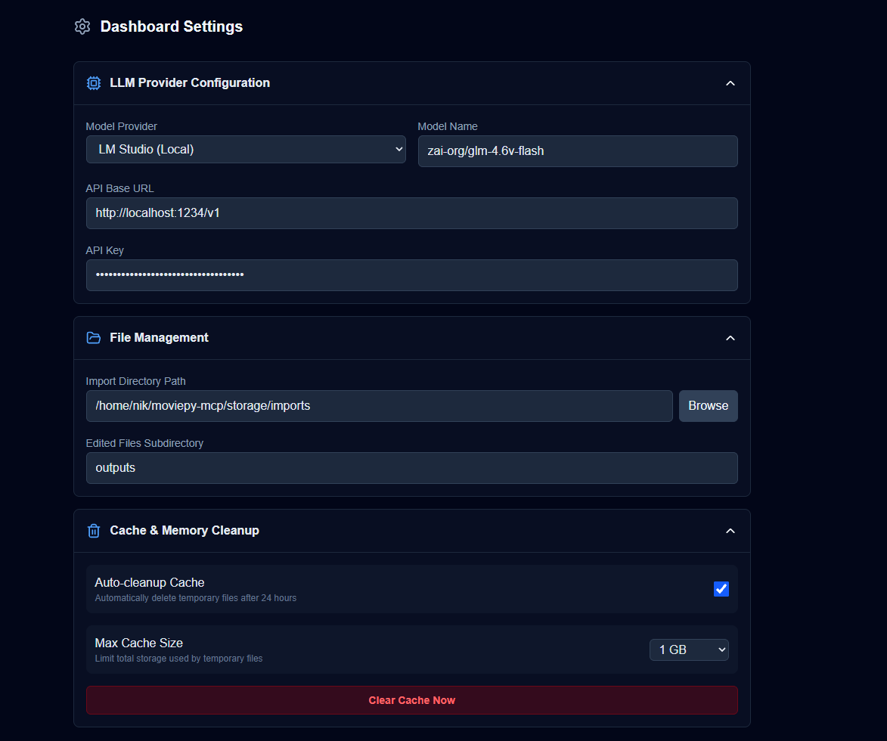
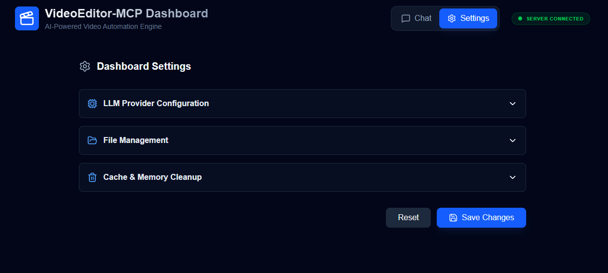

# VideoEditor-MCP

[](https://www.python.org/downloads/) [](https://opensource.org/licenses/MIT)

A powerful video generation and editing service powered by FastAPI, MoviePy, and FastMCP.

## 🎬 Description

VideoEditor-MCP provides a comprehensive service for programmatically creating and manipulating video and audio content. It exposes a rich set of tools through both a RESTful API (using FastAPI) and a Model-Context-Protocol (MCP) server, making it easy to integrate video editing capabilities into any application or AI agent-based workflow.

Whether you need to generate simple clips, perform complex edits, or composite multiple videos, this service offers a robust and easy-to-use solution.

### ✨ Key Features

*   **Dual-Interface**: Interact via a standard REST API or a flexible MCP server for AI agents.
*   **Rich Editing Suite**: A wide range of tools for video, audio, and compositing tasks.
*   **Extensible**: Built with a modular router-based architecture, making it easy to add new features.
*   **Containerized**: Comes with Docker support for easy deployment and scaling.
*   **Modern Tooling**: Uses `uv` for fast dependency management and `pytest` for robust testing.

## 📸 Screenshots

<p align="center">
  
  <br>
  <em>The main chat interface for interacting with the video editing agent.</em>
</p>

<table align="center">
  <tr>
    <td align="center">
      
      <br>
      <em>Expanded settings panel for configuring the LLM provider and model.</em>
    </td>
    <td align="center">
      
      <br>
      <em>Collapsed settings panel.</em>
    </td>
  </tr>
</table>

## 📖 Table of Contents

*   [Installation](#-installation)
*   [🚀 Quick Start](#-quick-start)
    *   [Environment Setup](#environment-setup)
    *   [Running the Application](#running-the-application)
*   [🛠️ API Documentation](#️-api-documentation)
    *   [Video Generation](#video-generation)
    *   [Video Editing](#video-editing)
    *   [Audio Processing](#audio-processing)
    *   [Compositing](#compositing)
*   [🤖 MCP Tools](#-mcp-tools)
*   [🧪 Development & Testing](#-development--testing)
    *   [Setup](#setup)
    *   [Running Tests](#running-tests)
*   [🐳 Docker Deployment](#-docker-deployment)
*   [📜 License](#-license)

## 📦 Installation

### Prerequisites

*   Python 3.12+
*   [uv](https://github.com/astral-sh/uv) (a fast Python package installer)
*   FFmpeg (required by MoviePy for video processing)

```bash
# On Debian/Ubuntu
sudo apt-get update && sudo apt-get install -y ffmpeg

# On macOS (using Homebrew)
brew install ffmpeg
```

### Setup

1.  **Clone the repository:**
    ```bash
    git clone https://github.com/your-username/moviepy-mcp.git
    cd moviepy-mcp
    ```

2.  **Install dependencies using `uv`:**
    This command creates a virtual environment and installs all required packages from `pyproject.toml`.
    ```bash
    uv sync
    ```

## 🚀 Quick Start

### Environment Setup

Before running the application, you need to set up the environment variables.

1.  **Backend Environment:**
    Create a `.env` file in the root of the project and add any necessary environment variables for the FastAPI server.

    ```bash
    # .env
    EXAMPLE_VARIABLE=example_value
    ```

2.  **Frontend Environment:**
    Create a `.env.local` file in the `frontend` directory and add your client-side environment variables.

    ```bash
    # frontend/.env.local
    NEXT_PUBLIC_EXAMPLE_VARIABLE=example_value
    ```

### Running the Application

This project now includes a `start.sh` script to streamline the development setup. This script handles installing dependencies for both the backend and frontend, and starts both services.

1.  **Install dependencies and start the development servers:**
    The following command will:
    - Install Python dependencies with `uv`.
    - Install Node.js dependencies with `npm`.
    - Start the FastAPI backend server.
    - Start the Next.js frontend development server.

    ```bash
    uv sync && cd frontend && npm i && cd ../ && ./start.sh --dev
    ```

The FastAPI server will be available at `http://localhost:8000` and the frontend at `http://localhost:3000`.

## 🛠️ API Documentation

The following is a summary of the available API endpoints. For detailed request/response models, please refer to the auto-generated docs at `http://localhost:8000/docs`.

### Video Generation

*   **`POST /video/generate`**: Creates a simple video with text on a background.

### Video Editing

*   **`POST /video-edits/cut`**: Trims a video.
*   **`POST /video-edits/concatenate`**: Joins multiple videos.
*   **`POST /video-edits/resize`**: Resizes a video.
*   **`POST /video-edits/speed`**: Changes the playback speed.
*   **`POST /video-edits/color-effect`**: Applies a color filter.
*   **`POST /video-edits/mirror`**: Mirrors the video horizontally or vertically.
*   **`POST /video-edits/rotate`**: Rotates the video.
*   **`POST /video-edits/crop`**: Crops the video.
*   **`POST /video-edits/margin`**: Adds a margin around the video.
*   **`POST /video-edits/fade`**: Applies fade-in or fade-out.
*   **`POST /video-edits/loop`**: Loops the video content.
*   **`POST /video-edits/time-effect`**: Applies time-based effects like reverse or freeze.

### Audio Processing

*   **`POST /audio/volume`**: Adjusts the volume of a video's audio.
*   **`POST /audio/extract`**: Extracts the audio track from a video.
*   **`POST /audio/fade`**: Fades the audio in or out.
*   **`POST /audio/loop`**: Loops the audio track.

### Compositing

*   **`POST /compositing/composite`**: Stacks or grids multiple videos together.
*   **`POST /compositing/text-overlay`**: Adds a text overlay to a video.
*   **`POST /compositing/image-overlay`**: Adds an image overlay to a video.

## 🤖 MCP Tools

The MCP server exposes a wide range of tools for agentic workflows. Each tool corresponds to one of the API functionalities.

**Example MCP Tools:**

*   `create_video(text: str, duration: float)`
*   `cut_video(video_path: str, start_time: float, end_time: float)`
*   `concatenate_videos(video_paths: List[str])`
*   `resize_video(video_path: str, scale: float)`
*   `text_overlay(video_path: str, text: str)`
*   `adjust_volume(video_path: str, factor: float)`
*   ...and many more!

Refer to `src/videoEditor_mcp/mcp_server.py` for a complete list of available tools and their signatures.

## 🧪 Development & Testing

### Setup

Follow the [Installation](#-installation) steps to set up the development environment. The `dev` dependency group in `pyproject.toml` includes `pytest` and `httpx` for testing.

### Running Tests

To run the full test suite:
```bash
uv run pytest
```

To run tests with code coverage analysis:
```bash
uv run pytest --cov=src
```

## 🐳 Docker Deployment

This project includes a `Dockerfile` and `docker-compose.yml` for easy containerization.

1.  **Build the Docker image:**
    ```bash
    docker-compose build
    ```

2.  **Run the service:**
    This will start the FastAPI server on port 8000.
    ```bash
    docker-compose up
    ```
    
## 📜 License

This project is licensed under the MIT License. See the [LICENSE](LICENSE) file for details.
